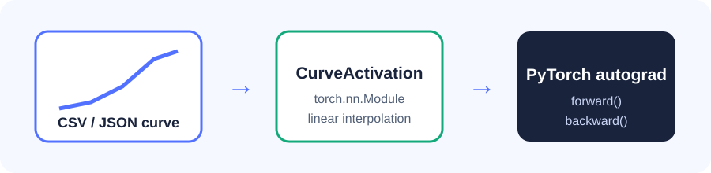

# PhotonAct

**PhotonAct 将测量或仿真的光学器件响应曲线转换成可微、支持双稳态轨迹的 PyTorch 激活函数。**

[](https://github.com/SoftBread1217/PhotonAct/actions/workflows/ci.yml)

[](LICENSE)



```bash
python -m pip install -e .
photonact inspect examples/curves/sample_phh.csv
photonact demo sample_phh
python examples/minimal.py
python examples/hysteresis.py
```

> **当前状态：** v0.1.0 是稳定版；v0.1.1 正在开发本地交互曲线体验器。核心功能已在
> Python 3.10-3.12 上测试。内置 `sample_phh` 是人工编写的合成演示曲线，不是实验数据，
> 也不是从论文图片数字化得到的数据。

[English README](README.md)

## 现在能做什么

项目现在建立了两个清晰的使用层次：

```text
单分支响应：CSV/JSON -> CurveActivation -> PyTorch 自动求导
双稳态轨迹：上下扫描分支 + 阈值 + 上一步状态 -> HysteresisActivation
```

```python
import torch
from photonact import CurveActivation

layer = CurveActivation.from_file("examples/curves/sample_phh.csv", branch="up")
x = torch.tensor([0.25, 0.75, 1.25], requires_grad=True)
layer(x).sum().backward()
print(x.grad)
```

如果器件有迟滞回线，可以让状态随输入轨迹切换：

```python
import torch
from photonact import HysteresisActivation

layer = HysteresisActivation.from_file("examples/curves/sample_phh.csv")
x = torch.tensor([0.2, 1.0, 1.8, 1.0, 0.2], requires_grad=True)
y, state_history = layer.forward_sequence(x, initial_state=False)
y.sum().backward()
```

输入达到 `upper_threshold` 时切到高态并采用 `down` 分支；输入降到
`lower_threshold` 时回到低态并采用 `up` 分支；两阈值之间保留传入状态。状态不会悄悄
存进模块，因此批处理、重置和复现实验都更明确。完整语义见
[docs/hysteresis.md](docs/hysteresis.md)。

## 本地交互体验

运行下面的命令会生成一个自包含 HTML，并在浏览器中打开：

```bash
photonact demo sample_phh
```

页面可以拖动输入功率、自动完成一次升降扫描、显示当前分支与状态，并在数据包含
`transmittance` 列时切换显示输出功率和透射率。体验本地私有论文曲线时运行：

```bash
photonact demo local_data/phh_1535nm/phh_1535nm.csv --output local_data/phh_1535nm/phh_1535nm_demo.html
```

生成的 HTML 内嵌了全部绘图数据。源曲线是私有数据时，这个 HTML 也必须保持私有；只有在
元数据声明的许可证允许时才能分享。无界面环境可加 `--no-open`。

## 建议的学习顺序

1. 运行 `photonact demo sample_phh`，先直观看到回线和状态切换。
2. 运行 [examples/minimal.py](examples/minimal.py)，观察单分支输出和梯度。
3. 运行 [examples/hysteresis.py](examples/hysteresis.py)，观察状态在上下阈值处切换。
4. 阅读 `photonact/curves.py`，理解 CSV/JSON 如何变成曲线对象。
5. 修改 `sample_phh.csv` 中的一个输出值，再运行示例和体验器。
6. 阅读 `tests/test_curves.py` 和 `tests/test_hysteresis.py`，理解边界与梯度验证。

## 数据格式

CSV 至少包含 `input_power` 和 `output_power`，可选 `branch`。同一分支内的输入必须严格递增。
同名 `.meta.json` 可以记录单位、来源、有效范围、归一化状态、许可证和引用信息。详细说明见
[docs/curve_data.md](docs/curve_data.md)。

## 插值与数据边界

v0.0.1 使用可微的分段线性插值，因为它比高阶样条更容易阅读、测试和解释。多分支曲线必须明确
选择分支；超出范围可选择 `clamp`、`linear` 或 `error`。

相关论文 [*Optical Bistability in Photonic Topological Hypercrystals and Its Applications in
Photonic Neural Network*](https://doi.org/10.3390/nano16090561) 是本项目的研究动机之一。
仓库不附带该论文的底层曲线数据，也不声称复现论文准确率。
`sample_phh` 仅用于展示接口，使用自己的数据时必须如实记录测量、仿真或数字化来源。

合法持有 Fig. 4(b) 源工作簿的作者，可以在本地转换数据：

```bash
python -m pip install -e ".[data]"
python scripts/prepare_phh_1535nm.py path/to/shuangwentiai.xlsx
python examples/hysteresis.py --curve local_data/phh_1535nm/phh_1535nm.csv
```

脚本不会改动源工作簿，会记录源文件 SHA-256、来源、波长、偏振、跃迁区间和输出功率
计算方式。默认输出目录 `local_data/` 已被 Git 忽略。在全体相关作者或权利人确认数据
许可证前，不要把生成文件公开提交。

## 项目边界

PhotonAct 专注于连接“光学响应曲线”和“机器学习模型”：检查带有来源说明的曲线数据，将曲线
封装成小型可微 `torch.nn.Module`，明确分支、外推、归一化和未来硬件效应的语义，并提供可以
审计配置和原始结果的可复现实验。

PhotonAct 不是电磁场求解器，不能代替器件表征，也不会在缺少来源证据时声称模型与真实硬件
一致。论文底层曲线数据尚未公开时，本项目不会声称完整复现该论文。

## 路线图

各版本目标和验收证据见 [docs/roadmap.md](docs/roadmap.md)。

代码采用 [MIT License](LICENSE)。贡献说明见 [CONTRIBUTING.md](CONTRIBUTING.md)，安全问题报告
方式见 [SECURITY.md](SECURITY.md)，版本变化见 [CHANGELOG.md](CHANGELOG.md)，引用信息见
[CITATION.cff](CITATION.cff)。
